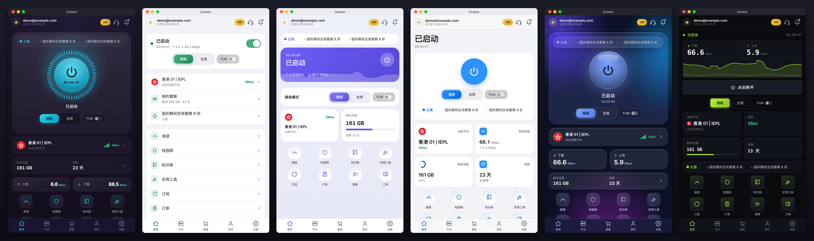
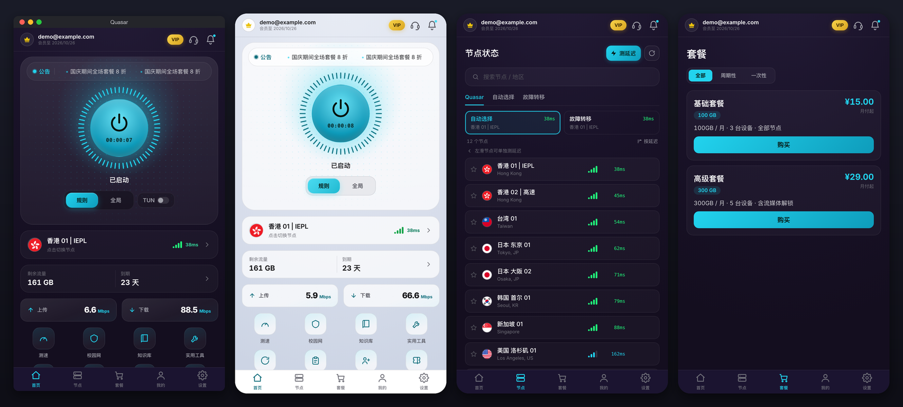
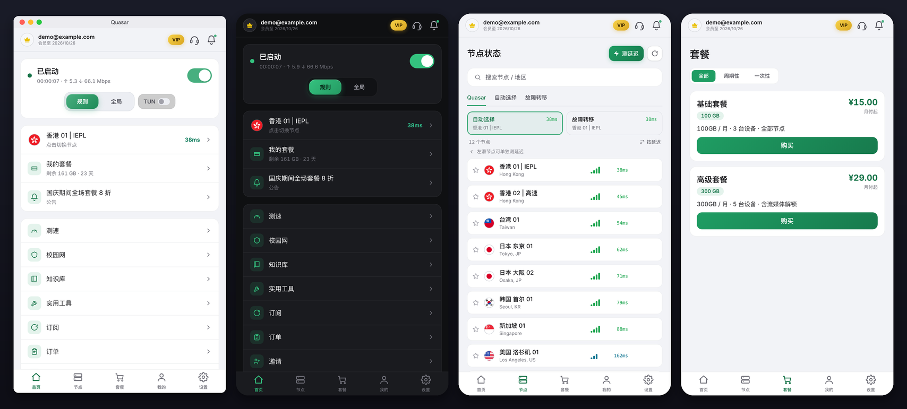
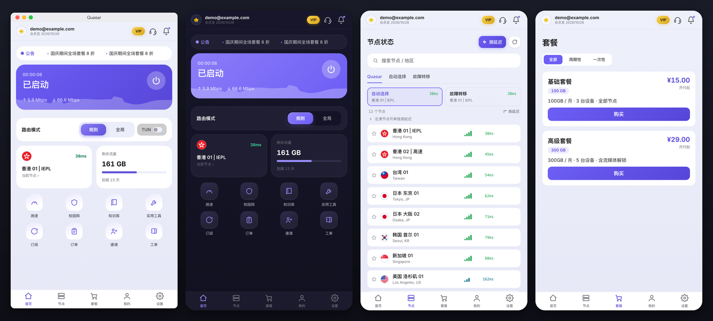
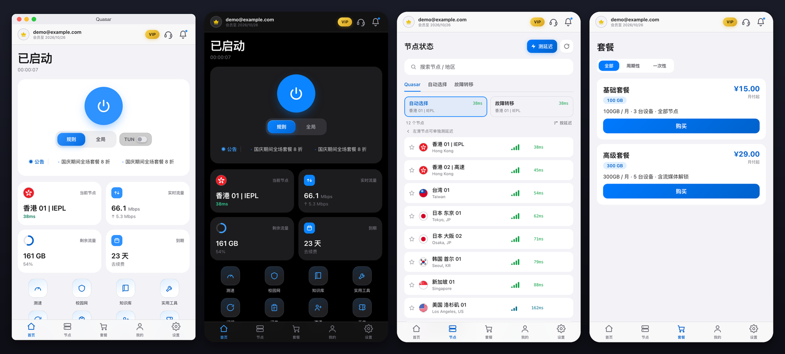
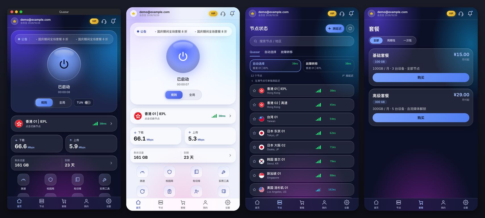
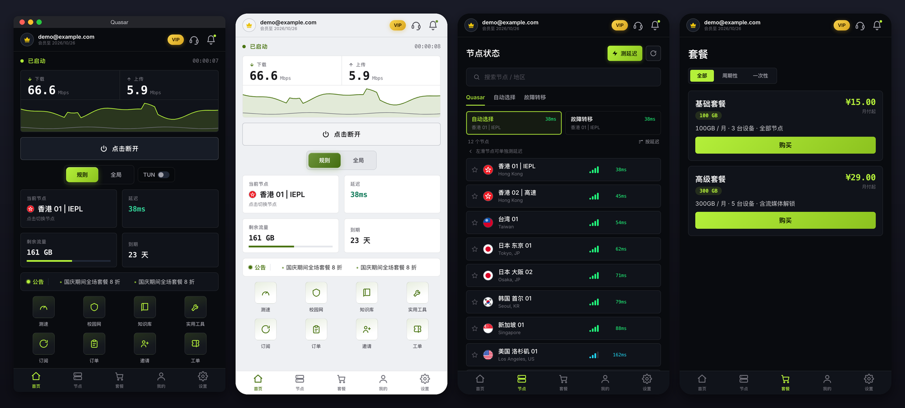

# Quasar — 免费的 V2Board / Xboard / PPanel 客户端

**Quasar 是给机场用的免费白标客户端**:对接 **V2Board、Xboard、PPanel** 三种面板,覆盖 **Windows、macOS、Linux、Android、Android TV**,内核可选 **sing-box + xray**、**mihomo(Clash.Meta)** 或 **mihomo Smart**,自带 **6 套界面**。不用搭编译环境,在线填好品牌信息就能打出自己品牌的安装包,**注册和打包都免费**。

**免费在线打包:<https://console.quasarapp.net/>**

[English](README.en.md)

---

## 目录

- [免费](#免费)
- [适合谁](#适合谁)
- [六套界面](#六套界面)
- [功能清单](#功能清单)
- [支持的面板](#支持的面板)
- [内核与协议](#内核与协议)
- [怎么打包](#怎么打包)
- [常见问题](#常见问题)

## 免费

- **客户端免费**:机场主免费使用,终端用户免费安装。
- **打包免费**:控制台账号由 Telegram 机器人自动发放,免费注册;登录后在线打包自己品牌的安装包。
- **入口**:打开 <https://console.quasarapp.net/>,登录页有「去 Telegram 机器人注册」,给机器人发 `/start` 就能拿到登录账号。免费账号打包时需要保持在官方 Telegram 频道和群组里。

## 适合谁

- **机场主**:想要一个挂自己品牌、对接自己面板的客户端,不想自己维护一套代码。
- **V2Board / Xboard / PPanel 用户**:面板自带的订阅链接要用户手动导入第三方软件;Quasar 让用户**用面板账号直接登录**,买套餐、看流量、选节点、开工单都在一个 App 里。

## 六套界面

打包时选一套,再配一个品牌色。**电脑和手机是同一套界面**:电脑上是一个可以拉大的竖窗,用户换设备不用重新熟悉。每套都支持浅色 / 深色 / 纯黑。下面每张图:最左是电脑窗口,右边三张依次是另一种明暗主题的首页、节点页和套餐页。

### 霓虹(默认)

深色霓虹风,首页是大号发光连接按钮。

### 极简

浅色分组列表,像系统设置页,最容易上手。

### 磁贴

圆角磁贴首页,品牌色最显眼。

### iOS 风格

大标题、圆形电源键、小组件,像苹果原生 App。

### 玻璃

渐变背景上的半透明玻璃卡片和玻璃球按钮。

### 仪表盘

深色专业风,实时流量图为主,小圆角、等宽数字。

> 截图里的账号、节点、套餐和流量都是演示数据。

## 功能清单

### 账号与套餐(直接对接面板)

- 用面板账号登录、注册、找回密码,可记住密码
- 套餐列表、下单、订单管理;余额充值、礼品卡兑换(视面板而定,见[下表](#支持的面板))
- 剩余流量、到期时间在首页直接看;快到期、流量快用完时提醒续费
- 邀请返利、工单、公告
- 知识库:机场主写的文档支持 Markdown / HTML / 纯文本,自动识别,带表格、代码高亮、提示框
- 流量明细、登录设备管理
- 订阅由客户端自动拉取和应用,**界面上不显示订阅链接**

### 节点与连接

- 节点列表:搜索、收藏、按延迟或名称排序、一键测延迟
- 自动选择(按延迟)、故障转移
- mihomo Smart 内核:按每条连接智能分配节点,节点页显示学到的排名
- 规则 / 全局 / 直连 三种模式
- TUN 模式(接管全部流量)和系统代理模式
- 断线自动重连
- **如实显示连接状态**:连上了但出不了网,会明确显示「无法访问外网」,不会假装正常
- 出口地区和节点名对不上时提示

### 分流与网络

- 自定义分流规则,内置常用地理规则集
- 去广告、屏蔽 QUIC、局域网直连、允许局域网设备连接
- DNS 设置、Fake-IP
- 分应用代理(Android)
- 校园网模式
- 链式代理 / 落地节点、自定义节点(机场主可开关)

### 抗封锁

- **订阅自愈**:订阅域名被封时,先用内置的 TLS 分片重试(零配置);机场主填了兜底节点的,再通过兜底节点拉取;都不行就用上次成功的订阅
- 面板地址可填多条线路,自动选最快的,挂了自动切换
- 默认内置 xray 引擎,支持 REALITY、XTLS-Vision、xHTTP 等传输

### 工具

- 网络测速
- 出口 IP 与流媒体解锁检测
- 实时连接列表、一键断开全部连接
- 诊断日志导出(自动隐去账号和订阅信息)

### 界面与体验

- 6 套界面 + 品牌色
- 浅色 / 深色 / 纯黑 / 跟随系统
- 中文、English
- 签名安装包自动更新

### 给机场主的

- 品牌名、图标、品牌色、界面皮肤、登录页文案、默认语言和主题
- 三种内核任选(见[内核与协议](#内核与协议))
- 在线客服接入:Crisp、Chatwoot、SalesSmartly 或自定义链接
- 首页快捷入口、常用 App 下载列表可配置
- 默认分流规则、DNS、测速地址等**在控制台改完发布即生效,不用重新打包**
- 配置文件就是一份 JSON,可选加密

## 支持的面板

| 功能 | V2Board | Xboard | PPanel |
|---|:---:|:---:|:---:|
| 登录 / 注册 / 套餐 / 订单 | ✅ | ✅ | ✅ |
| 公告 / 知识库 / 工单 / 邀请 | ✅ | ✅ | ✅ |
| 余额充值 | ✅ | — | ✅ |
| 礼品卡 | ✅ | ✅ | — |
| 流量明细 | ✅ | ✅ | — |
| 登录设备管理 | ✅ | ✅ | ✅ |

「—」是面板本身没有对应接口。

## 内核与协议

| 内核 | 说明 |
|---|---|
| **sing-box + xray**(默认) | sing-box 做主内核,内置 xray 负责 xHTTP 等 sing-box 不支持的传输 |
| **mihomo** | 即 Clash.Meta 内核,由固定版本源码编译 |
| **mihomo Smart** | 在 mihomo 基础上,自动选择改为按连接智能分配节点 |

支持的节点协议:VMess、VLESS(含 REALITY / XTLS-Vision / xHTTP)、Trojan、Shadowsocks、Hysteria、Hysteria2、TUIC、AnyTLS、SOCKS5、HTTP。mihomo 内核另支持 WireGuard。

## 怎么打包

1. 打开 **<https://console.quasarapp.net/>**,没有账号的先点「去 Telegram 机器人注册」免费领取
2. 新建品牌:填品牌名、面板类型(V2Board / Xboard / PPanel)和面板地址,上传图标
3. 选界面皮肤、品牌色、内核
4. 选要打的平台(Windows / macOS / Linux / Android / Android TV),开始打包
5. 打包完成后下载安装包,分发给你的用户

之后改分流规则、DNS、客服等运行时配置,在控制台点「发布配置」即可,已安装的客户端会自动拿到。

## 常见问题

**收费吗?**
免费。客户端免费,注册控制台账号和在线打包也免费。账号通过 Telegram 机器人领取,免费账号打包时需要保持在官方频道和群组里。

**V2Board、Xboard、PPanel 都能用同一个客户端吗?**
能。打包时选面板类型,客户端会按该面板的接口对接。一个安装包对应一个面板类型。

**用户需要手动导入订阅吗?**
不需要。用户用面板账号登录,客户端自动拉取并应用订阅。

**可以换成自己的品牌吗?**
可以。名称、图标、配色、界面皮肤都在打包时设置,安装包里显示的是你的品牌。

**支持哪些系统?**
Windows、macOS、Linux、Android、Android TV。桌面三端最成熟,Android 和 TV 是较新的平台。

**用的是什么内核?**
默认 sing-box + xray,也可以选 mihomo(Clash.Meta)或 mihomo Smart。

**订阅域名被封了怎么办?**
客户端内置订阅自愈:TLS 分片重试是零配置的;机场主在控制台填了兜底节点,还能通过兜底节点拉取订阅;最后会回退到上次成功的订阅。首次安装就完全被封、又没填兜底节点的情况救不了。

---

**关键词**:免费 V2Board 客户端、免费 Xboard 客户端、免费 PPanel 客户端、免费机场客户端、V2Board 客户端、Xboard 客户端、PPanel 客户端、机场客户端、白标客户端、sing-box 客户端、xray 客户端、mihomo 客户端、Clash.Meta 客户端、Windows / macOS / Linux / Android / Android TV 代理客户端。
